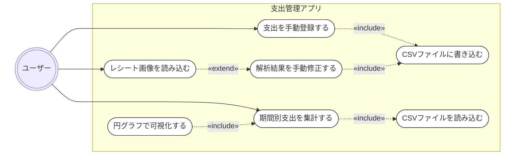
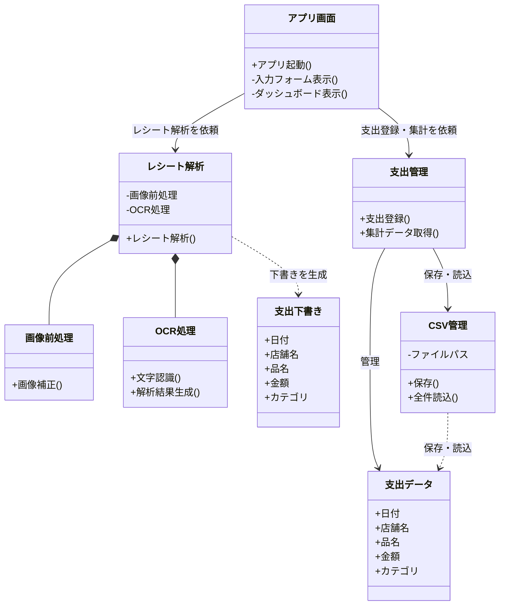
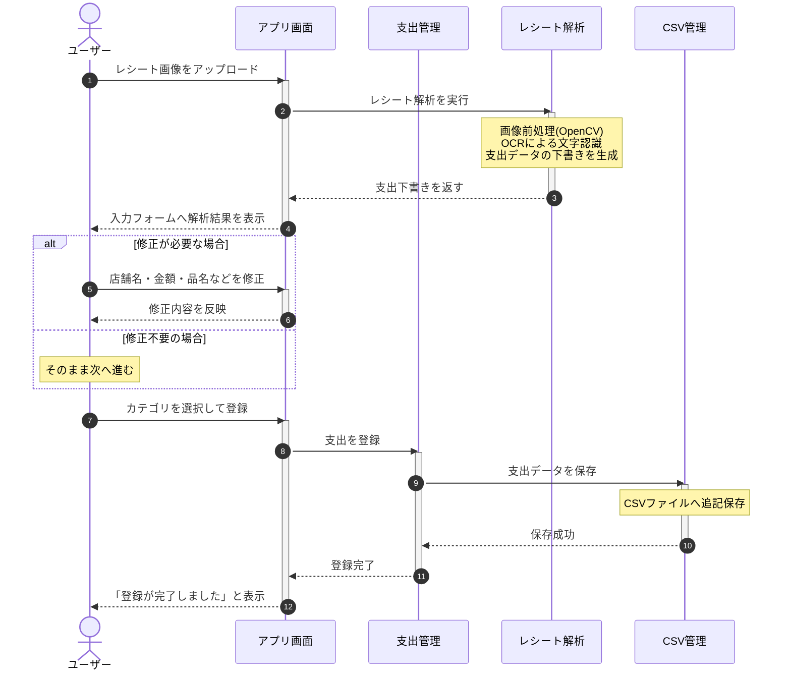
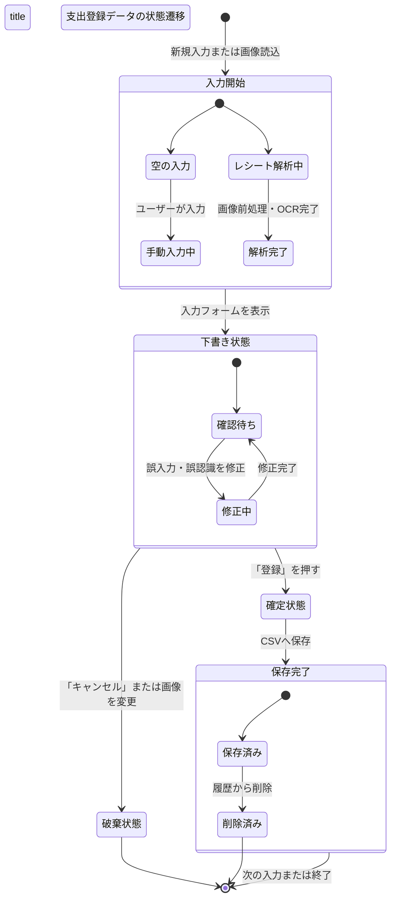

# スマート支出管理アプリ (Smart Expense Manager)

大学3年生のPBL（課題解決型学習）として開発する、レシート画像解析機能付きの支出管理アプリケーションです。
手動での支出登録に加え、OpenCVとOCRを組み合わせたレシート解析補助機能を備え、最終的な支出データをCSVファイルで永続化・可視化します。

## 概要
本アプリは、「レシート入力の手間を減らす」ことと「正確なデータ管理」を両立する支出管理システムです。
OCRによる自動解析は100%の精度を目指すのではなく、**「AI/アルゴリズムが下書き（Draft）を作り、人間が確認・修正して確定（Confirm）する」**というアプローチ（Human-in-the-Loop）を採用し、ユーザーがストレスなく、かつ正確に家計簿をつけられる環境を提供します。

---

## 機能要件
1. **支出の手動登録機能**
   * 日付、店舗名、品名、金額、カテゴリをユーザーが直接入力して登録できること。
2. **レシート画像解析補助機能**
   * アップロードされたレシート画像をOpenCVで前処理し、OCRエンジンで文字を抽出して自動で入力フォームに下書き（補完）すること。
3. **データ検証とエラー表示**
   * 必須項目の未入力や、金額への文字入力などの不正なユーザー入力に対して、適切なエラーメッセージを表示すること。
4. **CSV永続化・履歴管理機能**
   * 確定した支出データをローカルのCSVファイルに追記・保存できること。また、保存された履歴一覧からデータを削除できること。
5. **ダッシュボード（集計・可視化）機能**
   * 期間別（月別など）の支出を集計し、カテゴリごとの割合を円グラフで可視化表示できること。

---

## サブ機能一覧
* **UI（ユーザーインターフェース）部**
  * 入力フォーム（手動入力・下書き修正用）
  * 画像アップロードコンポーネント
  * 履歴一覧データテーブル（削除ボタン付き）
  * 期間選択フィルター
  * 統計情報コンポーネント（総支出表示、Streamlitベースの円グラフ）
* **レシート解析部**
  * 画像前処理（グレースケール化、二値化などによるOCR精度向上）
  * 文字列パースアルゴリズム（OCRテキストから日付・金額・店名を特定する処理）
* **データ管理部**
  * CSV書き込み（バリデーション通過データの追記）
  * CSV読み込み（集計および履歴一覧表示用）
  * CSV行削除（物理削除対応）

---

## 作らないもの（スコープ外）
本プロジェクトの期間内では、以下の機能は実装対象外（スコープ外）とします。
* **ユーザー認証・アカウント管理機能**（ローカル環境での単一ユーザー利用を前提とするため、ログイン画面やマルチユーザー対応は行わない）
* **クラウドデータベース（RDB/NoSQL）の構築**（すべてのデータ管理はローカルのCSVファイルで行う）
* **高精度な汎用レシート解析**（あらゆるレシートへの対応は目指さず、特定のフォーマットや、一定の明瞭さを持つ画像にターゲットを限定する）
* **複数資産（口座・クレジットカード）の連携・管理**（現金や一括の支出管理のみに特化する）

---

## 設計図（Mermaid）

### ユースケース図

### クラス図

### シーケンス図

### 状態遷移図
