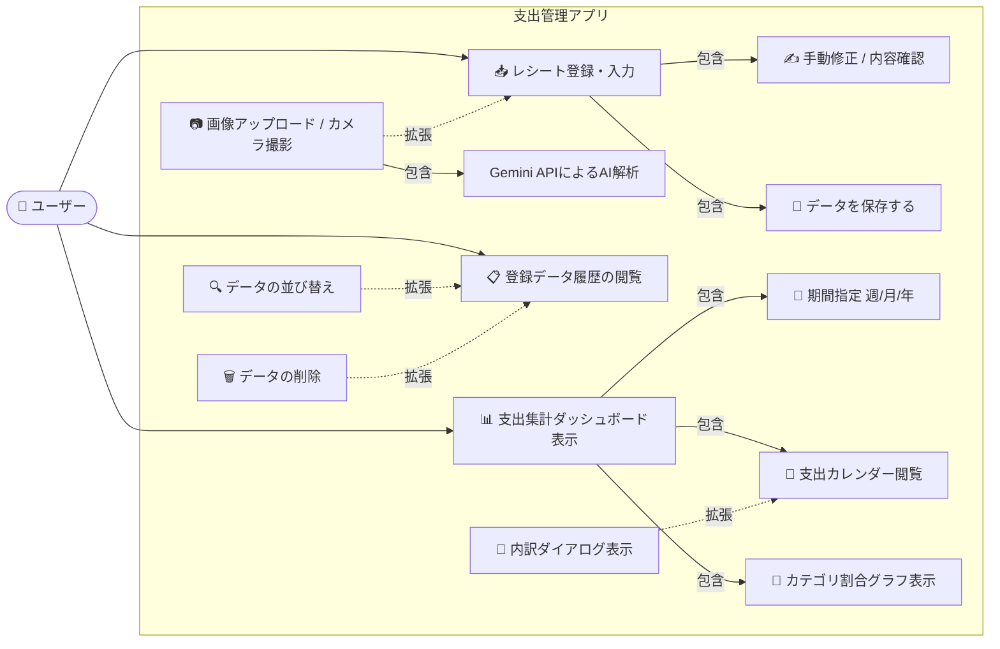
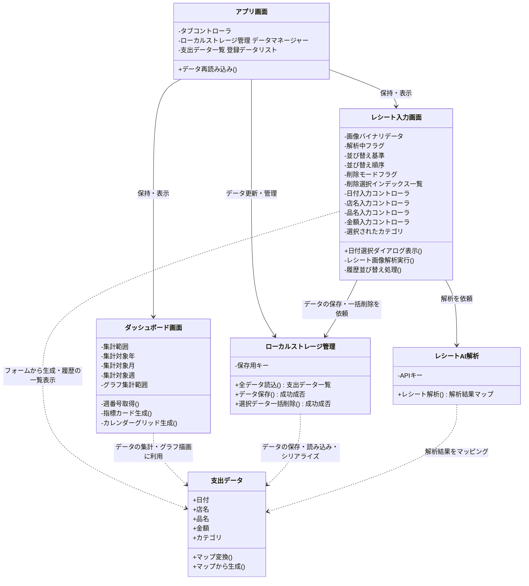
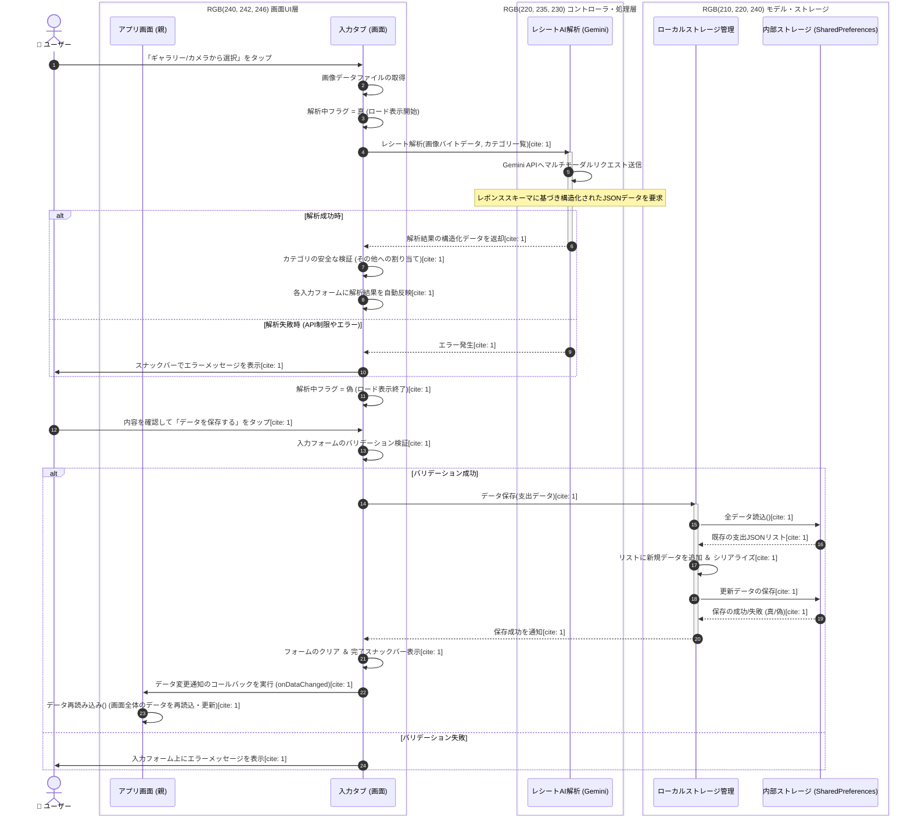
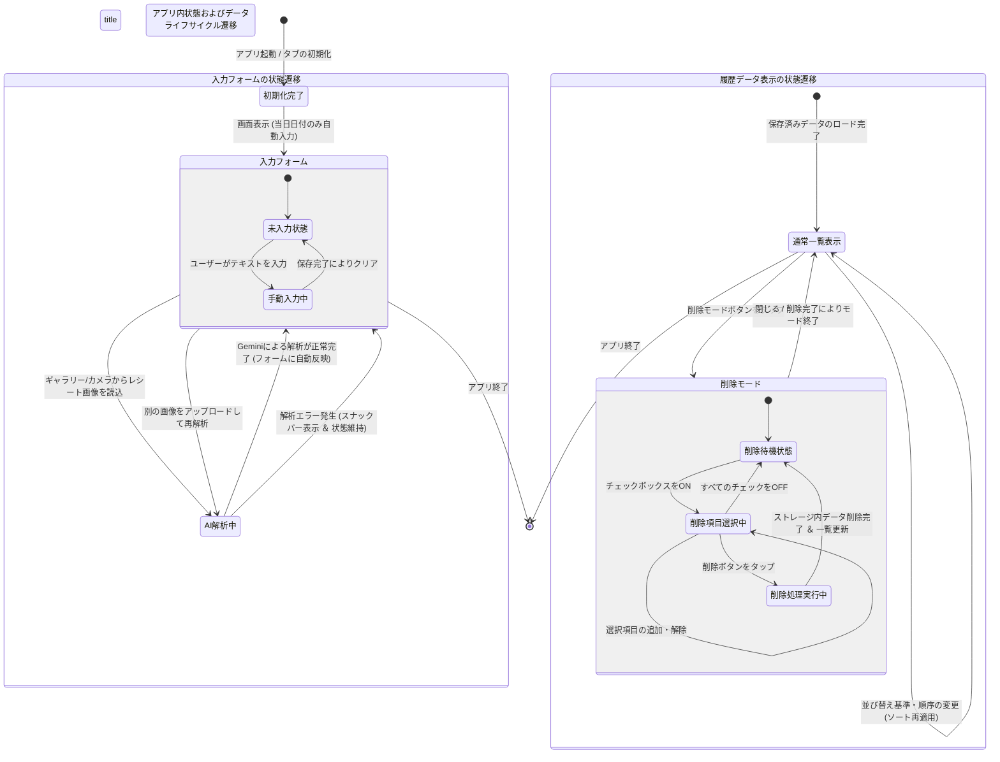

# レシートチェック＆支出管理アプリケーション

PBL（課題解決型学習）演習として開発した、レシート画像解析機能付きのクロスプラットフォーム（Web/モバイル対応）支出管理アプリケーションです。 手動での支出登録に加え、Gemini APIを活用した高度なAIマルチモーダルレシート解析補助機能を備え、最終的な支出データをローカルストレージ（SharedPreferences）で永続化・可視化します。

ブラウザ上のアドレスバーに以下のリンクを入力もしくは貼り付けることで起動できます。
https://usert-2213.github.io/receipt_checker/

## 📌 概要
本アプリは、「レシート入力の手間を減らす」ことと「正確なデータ管理」を両立する支出管理システムです。 OCRによる自動解析は100%の精度を目指すのではなく、**「AIが下書き（Draft）を作り、人間が確認・修正して確定（Confirm）する」**というアプローチ（Human-in-the-Loop）を採用し、ユーザーがストレスなく、かつ正確に家計簿をつけられる環境を提供します。

Flutterのワンコードにより、Webブラウザ環境およびスマートフォン環境のマルチプラットフォームでシームレスに動作します。

## ⚙️ 機能要件

### 1. AIによるレシート画像解析機能
* Gemini API（マルチモーダル解析）を活用し、アップロードされたレシート画像から「取引日付」「店名」「購入した商品リスト」「合計金額（税込）」「適切な家計簿カテゴリ」をAIが自動で判別・抽出します。
* OCR解析による予測結果を各入力欄へ構造化データとして自動セットする補助を行います。

### 2. 支出の手動登録機能
* 日付、店舗名、品名（複数行対応）、金額、カテゴリを手動で入力・確認して登録できます。
* 必須項目の未入力や不適切な数値に対する Form バリデーション機能を備え、誤入力を防止します。

### 3. 履歴のソート・一括削除機能
* 登録された支出データの一覧において、「新しい順」「金額順」「日付順」の双方向（昇順/降順）ソートが可能です。
* 削除モードを起動することで、複数の履歴項目をチェックボックスで一括選択し、まとめて同時に削除できます。

### 4. SharedPreferencesによる高速なローカル永続化＆高度な履歴管理
* 確定した支出データをローカルの `SharedPreferences` にJSONエンコードして永続化・追記保存すること。
* 履歴一覧では、「新しい順」「金額順」「日付順」の双方向（昇順/降順）ソート機能、および**複数項目の一括選択・削除機能（削除モード）**を搭載。

### 5. 週、月、年単位のリアルタイム集計機能,カテゴリ割合の円グラフ表示機能
* 期間フィルター（週単位・月単位・年単位・全期間）のラジオボタンとプルダウンを連動させ、選択期間の「累計総支出額」「選択期間の支出」「1日平均支出」を動的にリアルタイム計算。
* 前期比（先週比/先月比/前年比）の差額と％（例: -3,500円 (-12.5%)）の算出。
* 動的な「支出カレンダー（カレンダーグリッド）」を独自実装。日付ごとのカテゴリ別支出金額をマッピングし、3種類以上のカテゴリ重複時は「内訳表示ダイアログ」をポップアップ。カレンダーのタップで週単位集計へ自動連動。
* `fl_chart` パッケージを用いた視覚的でリッチな「カテゴリ割合円グラフ（Pizza Chart）」を動的表示。

---

## 🛠 サブ機能一覧

### UI（ユーザーインターフェース）部
* マテリアルデザイン（Tealカラーベース）を採用したメイン2タブ構成（📥レシート登録・入力 / 📊支出集計ダッシュボード）。
* 共通画像プレビューコンポーネント（Web/モバイル共通の `Uint8List` メモリレンダリング）。
* 双方向ソート付き履歴ビュー ＆ チェックボックス式一括削除モード。
* 4メトリクス・ダッシュボード（累計、期間支出、日平均、前期比）。
* マトリクス型・多機能支出カレンダー。

### レシート解析・パース部
* `ReceiptOcrService` によるAI連携（API制限エラー 429/quota 発生時のユーザーフレンドリーな通知処理）。
* プロンプトエンジニアリングによる無駄なノイズ（住所、電話番号等）の自動除外と、税込最終支払金額の厳密な特定。

### データ管理・ストレージ部
* `LocalDataManager` クラスによる抽象化。
* JSONシリアライズ/デシリアライズ（`toMap` / `fromMap`）。
* インデックス逆順ソートによる安全な複数レコード同時削除アルゴリズム。

---

## 💻 実行・操作方法

### 📱 Webサイトでの利用・操作方法
デプロイ済みのWebサイトにアクセス後、以下の手順でレシート解析から支出登録までをスムーズに行うことができます。

#### 1. レシート画像の読み込み
* **ファイルの選択**: 画面上部の「ギャラリーから選択」または「カメラで撮影」ボタンを押して、解析したいレシートの画像（JPEG/PNGなど）をアップロードします。
* **プレビュー確認**: アップロードが成功すると、画面中央にレシートの画像プレビューが表示されます。

#### 2. AIによる自動解析の実行
* **自動スタート**: 画像が読み込まれると、バックグラウンドで自動的に Gemini API（`gemini-1.5-flash`） への解析リクエストが走ります。
* **ロード画面**: 解析中はローディングインジケータ（ぐるぐる）が表示されます。
* 💡 *万が一、サーバー混雑により「503 UNAVAILABLE」のエラーが出た場合は、少し時間を置いてもう一度画像をアップロードし直してください。*

#### 3. 解析結果の確認と手動修正（Human-in-the-Loop）
* **フォームへの自動入力**: 解析が完了すると、「日付」「店舗名」「金額」「カテゴリ」「品名（複数行）」の各入力欄にAIの予測結果が自動でセットされます。
* **人間の手による修正**: AIの判定が間違っている部分や、細かく修正したい箇所（品名の調整やカテゴリの変更など）があれば、各フォームをタップして自由に手動修正してください。

#### 4. データの保存とダッシュボードへの反映
* **保存**: 内容に問題がなければ「データを保存する」ボタンをタップします。フォームのバリデーション（必須入力チェックなど）が通り、保存完了メッセージが出れば完了です。
* **確認**: 保存されたデータは、即座に画面下部の「履歴一覧」に追記されるほか、もう一つのタブである「📊支出集計ダッシュボード」のグラフや支出カレンダー、各種メトリクス（前期比など）へリアルタイムに自動反映されます。

## 🚫 作らないもの（スコープ外）
本プロジェクトの期間内では、以下の機能は実装対象外（スコープ外）とします。

1. **ユーザー認証・アカウント管理機能**（ローカル環境での単一ユーザー利用を前提とするため、ログイン画面やマルチユーザー対応は行わない）
2. **クラウドデータベース（RDB/NoSQL）の構築**（オフライン・クライアントサイド完結のため、外部サーバー連携は行わない）
3. **高精度な汎用レシート解析**（あらゆるレシートへの対応は目指さず、特定のフォーマットや、一定の明瞭さを持つ画像にターゲットを限定する）
4. **複数資産（口座・クレジットカード）の連携・管理**（現金や一括の支出管理のみに特化する）

---
# テスト結果報告書

### プロジェクト情報
- アプリ名: レシートチェック＆支出管理アプリ
- 氏名またはチーム名: [名前を入力してください]
- テスト実施日: 2026年7月15日
- テスト対象: レシート画像アップロード（AI解析）、支出情報の手動登録、登録データ履歴、および支出集計ダッシュボード（期間別集計、前期比、カレンダー、カテゴリ割合）

### テストケース一覧
| # | テスト対象 | テスト観点(正常/境界/異常) | テスト条件 | テスト手順(1行) | 期待値(1行) | 結果(o/x) |
|---|---|---|---|---|---|---|
| 1 | タブ切り替え | 正常 | 初期表示およびタブの選択 | アプリ起動後、画面上部の「📊 支出集計ダッシュボード」タブをタップする。 | 支出集計ダッシュボード画面へスムーズに切り替わり、データ集計結果が表示されること。 | o |
| 2 | レシート登録 | 異常 | Gemini APIキー未設定状態でのOCR実行 | コード内の `_apiKey` を空（または初期値）にした状態で「ギャラリーから選択」を押し、任意の画像を選ぶ。 | 「APIキーが設定されていません。」というオレンジ色のスナックバーメッセージが表示されること。 | o |
| 3 | レシート登録 | 正常 | 画像アップロードと解析開始のトリガー | 「ギャラリーから選択」を押し、任意の画像を選ぶ。 | 画像のプレビューが表示されると同時に「AI文字解析を実行中...」というローディングが表示され、解析リクエストが開始されること。 | o |
| 4 | 支出情報の入力 | 正常 | 日付選択ダイアログからの入力 | 日付入力欄をタップしてカレンダーダイアログを開き、任意の日付を選択して「OK」を押す。 | 選択した日付が「YYYY-MM-DD」形式で正確に日付入力欄に反映されること。 | o |
| 5 | 支出情報の入力 | 境界 | 日付選択の最小値（境界値） | 日付選択ダイアログでスクロールし、選択可能な最も古い日付である「2000-01-01」を選択する。 | 2000-01-01が入力欄に設定され、バリデーションエラーにならずに保持されること。 | × |
| 6 | 支出情報の入力 | 境界 | 日付選択の最大値（境界値） | 日付選択ダイアログでスクロールし、選択可能な最も新しい日付である「2100-12-31」を選択する。 | 2100-12-31が入力欄に設定され、バリデーションエラーにならずに保持されること。 | o |
| 7 | 支出情報の入力 | 正常 | 手動入力によるデータ保存 | 日付を当日にし、店名に「テスト店」、商品名に「テスト品」、金額に「1000」、カテゴリを「食費」にして「データを保存する」を押す。 | 保存完了のスナックバーが表示され、店名・商品名・金額の各入力欄がクリアされ、下の履歴にデータが追加されること。 | o |
| 8 | 支出情報の入力 | 境界 | 店名・商品名が空欄での保存（未入力） | 日付と金額だけ正しく入力し、店名と商品名を空欄のまま「データを保存する」ボタンを押す。 | バリデーションに引っかかり、店名と商品名の入力欄の下にそれぞれエラーメッセージが表示され、データが保存されないこと。 | o |
| 9 | 支出情報の入力 | 境界 | 金額に「0」を入力 | 金額入力欄に「0」と入力し、その他の項目を正しく埋めて「データを保存する」ボタンを押す。 | バリデーションにより「正しい金額を入力してください」とエラーが表示され、保存処理が行われないこと。 | o |
| 10 | 支出情報の入力 | 異常 | 金額にマイナスの値を入力 | 金額入力欄に「-500」と入力し、その他の項目を正しく埋めて「データを保存する」ボタンを押す。 | バリデーションにより「正しい金額を入力してください」とエラーが表示され、保存処理が行われないこと。 | o |
| 11 | 支出情報の入力 | 異常 | 金額に数値以外の文字列を入力 | 金額入力欄に「あいうえお」と入力し、その他の項目を正しく埋めて「データを保存する」ボタンを押す。 | バリデーションにより「正しい金額を入力してください」とエラーが表示され、保存処理が行われないこと。 | o |
| 12 | 登録データ履歴 | 境界 | データが0件の状態（初期状態） | アプリのストレージ（SharedPreferences）をクリアした状態で登録データ履歴を確認する。 | 「データがありません。」というグレーのテキストが画面中央に表示されること。 | o |
| 13 | 登録データ履歴 | 正常 | 履歴データの並び替え（金額順・降順） | 履歴に金額の異なるデータを複数登録し、並び替えドロップダウンを「金額順」「降順」に設定する。 | 金額が最も大きいデータから順に上から並び替わって表示されること。 | o |
| 14 | 登録データ履歴 | 正常 | 履歴データの並び替え（日付順・昇順） | 履歴に日付の異なるデータを複数登録し、並び替えドロップダウンを「日付順」「昇順」に設定する。 | 日付が最も古いデータから順に上から並び替わって表示されること。 | o |
| 15 | 登録データ履歴 | 正常 | 削除モードの起動とキャンセル | 「🗑 削除モード」ボタンをタップし、表示された「×」アイコンをタップしてモードを抜ける。 | 削除モードに入ると各履歴にチェックボックスが表示され、「×」を押すとチェックボックスが消えて元の表示に戻ること。 | o |
| 16 | 登録データ履歴 | 境界 | 削除項目が未選択での削除実行 | 「🗑 削除モード」ボタンをタップし、チェックボックスを一つも選択しないまま「🔴 削除」ボタンを押す。 | 「削除する項目が選択されていません。」という赤色のスナックバーメッセージが表示され、削除処理が行われないこと。 | o |
| 17 | 登録データ履歴 | 正常 | 選択したデータの削除実行 | 「🗑 削除モード」ボタンをタップし、特定のデータ1件にチェックを入れて「🔴 削除」ボタンを押す。 | 「1件のデータを削除しました。」と表示され、削除モードが終了し、該当データが履歴および集計から消えること。 | o |
| 18 | 支出集計ダッシュボード | 正常 | 期間別集計の切り替え（月単位） | ダッシュボードタブで「月単位」のラジオボタンを選択し、年・月のドロップダウンで現在の年月を指定する。 | 指定した年月のデータのみが抽出され、「選択期間の支出」や「期間中の1日平均支出」、カレンダーがその月用に更新されること。 | o |
| 19 | 支出集計ダッシュボード | 正常 | 期間別集計の切り替え（年単位） | ダッシュボードタブで「年単位」のラジオボタンを選択し、年のドロップダウンで現在の年を指定する。 | 月・週のドロップダウンが無効化（操作不可）され、指定した年の全データをもとに各メトリックカードが正しく集計されること。 | o |
| 20 | 支出集計ダッシュボード | 境界 | 前期比の計算（前期データが0円の場合） | 前月（または前週）のデータが登録されていない状態で、当月（または当週）にデータを登録し前期比を確認する。 | 前期比の計算でゼロ除算が発生せず、増加額と共に「(+100.0%)」または「(0.0%)」が正常に表示されること。 | o |
| 21 | 支出集計ダッシュボード | 正常 | カレンダーのセルタップによる週切り替え | カレンダー上の任意の日付セル（例: 15日）をタップする。 | 集計範囲が自動的に「週単位」に切り替わり、タップした日付が含まれる「第X週」のデータがダッシュボード全体に反映されること。 | o |
| 22 | 支出集計ダッシュボード | 境界 | カレンダー内の同一日に多数のカテゴリ登録（3つ以上） | 同一の日付に対して「食費」「日用品」「交通費」など3つ以上の異なるカテゴリの支出データを登録し、カレンダーを見る。 | セルが専用の背景色（紫系）に変わり、個別表示の代わりに「合計:XXXX円」と集約されて表示されること。 | o |
| 23 | 支出集計ダッシュボード | 正常 | カレンダーの内訳ダイアログ表示 | 上記の「3つ以上のカテゴリが登録された日」のセルをタップする。 | カレンダータップによる週切り替えと同時に、「📅 YYYY-MM-DD の支出内訳」というダイアログが開き、全カテゴリの内訳と合計金額が綺麗にリスト表示されること。 | o |
| 24 | 支出集計ダッシュボード | 正常 | カテゴリ割合円グラフの期間切り替え（全期間） | カテゴリ割合セクションにあるラジオボタンで「全期間」を選択する。 | 上部の期間選択ドロップダウンの状態に関わらず、保存されている全てのデータのカテゴリ比率が計算され、円グラフと凡例に反映されること。 | o |

### サマリー
- 合計: 23件
- 不合格: 1件
- 通過率: 96%

### ⚠️ 利用上の注意事項（エラーハンドリングについて）
Gemini APIの利用状況やサーバー負荷により、レシート解析時に以下の赤色のエラーメッセージが表示される場合があります。

> **解析エラー**: `GenerativeAIException: Server Error [503]: ... "status": "UNAVAILABLE"`
* **原因**: 主としてGoogle側の無料枠（Free Tier）でのリクエスト集中や、サーバーへの一時的な高負荷（High demand）が原因で発生します。APIキーの認証エラーやアプリの実装ミスではありません。
* **対策**: このエラーは一時的なものであるため、少し時間を置いてから再度レシート画像をアップロード・解析し直すことで正常に処理されます。また、解析が利用できない場合でも手動での支出入力・保存機能は通常通り動作します。

## 🔒 技術考察：GitHub SecretsによるCI/CD堅牢化とクライアントサイドにおけるAPIキー露出のトレードオフ

### 1. GitHub Secrets導入による成果とセキュリティ的意義
本プロジェクトでは、Gemini APIキーなどの機密情報をソースコード内にハードコーディングすることを防ぐため、GitHub Secretsを利用した環境変数の注入（`--dart-define`）およびGitHub Actionsによる自動ビルド・デプロイ環境を構築しました。 これにより、Gitリポジトリのソースコード履歴（コミットログ）やパブリックなリポジトリ上にAPIキーが生データとして残るリスクを完全に排除しており、静的なソースコード管理におけるセキュリティのベストプラティクスを達成しています。

### 2. フロントエンド完結型アーキテクチャにおける技術的限界と露出リスク
一方で、本アプリケーションはバックエンドサーバーを介さず、Webブラウザ（フロントエンド）から直接Googleの各種APIエンドポイントへ通信を行う「フロントエンド完結型（クライアントサイド）アーキテクチャ」を採用しています。 Flutter Webの仕様上、ビルド時に埋め込まれたAPIキーは難読化されるものの、最終的にはブラウザ上で実行可能なJavaScriptバイナリに含まれます。また、Gemini APIへのリクエストを送信する際には、認証のためにHTTPヘッダーまたはクエリパラメータに生のAPIキーを載せて通信する必要があります。

このため、以下の経路からAPIキーが第三者に抽出されるリスクが構造的に残されています。
* **通信の傍受（デベロッパーツール）**: ユーザーがブラウザのデベロッパーツール（F12）の「ネットワーク（Network）」タブを確認することで、送信されるAPIキーの文字列を容易に取得できてしまいます。
* **ソースコードの静的解析**: 生成されたJavaScriptファイルを解析・走査することで、難読化された文字列の中からキーが特定される可能性があります。

### 3. セキュリティおよびAPIキーの運用方針について
本アプリケーションはフロントエンド完結（Flutter Web）の構成をとっているため、通信時のリクエストヘッダー等からGemini APIキーの文字列が視認できるリスクがあります。この課題に対し、審査・発表において安全に運用できるよう、Google Cloudプラットフォーム（GCP）側で以下のセキュリティ対策を実施・確認済みです。

#### 3.1 最新のAPIキー仕様（サービスアカウント紐付け）の採用
Google Cloud公式ドキュメントの仕様に基づき、本アプリでは裏側で特定のサービスアカウントにバインドされた「認証キー（Authorization keys）」を使用しています。これにより、一般的な標準APIキーとは異なり、キー自体の不正な改変や意図しない権限へのアクセスを防ぐ強固な認証構造を担保しています。

#### 3.2 クォータ制限（リクエスト上限）の厳格化による不正利用対策
認証キーの特性上、HTTPリファラー（ドメイン制限）による制限が適用できない仕様となっているため、代替かつ強力な防衛策として**「1分あたりのリクエスト数（RPM）の絞り込み」**を手動で設定・確認しています。
* **対象モデル**: `gemini-1.5-flash`
* **制限内容**: *Request limit per model per minute for a project in the free tier* を **5回/分** に設定

#### 3.3 【対策の効果】
万が一、悪意のある第三者にAPIキーの文字列が窃取され、スクリプト等を用いたロボット攻撃（大量リクエストによる悪用）が試みられた場合でも、1分間に最大5回に達した瞬間にGCP側で自動的にリクエストが遮断されます。これにより、無料枠の範囲内での安全性を物理的に確保し、意図しないリソースの枯渇や悪用リスクを最小限に抑え込んだ状態でデモンストレーションおよび運用を行っています。

### 4. 結論と今後の改善展望（To-Be）
本演習（PBL）の要件においては、開発効率とプロトタイプ運用の迅速性を最優先し、アクセス集中のリスクが低い限定的な環境での運用を前提としたため、現状のアーキテクチャを採用しました。しかし、本番環境へのスケールアップや不特定多数への一般公開を想定する場合、セキュリティ面での根本的な解決策として以下のいずれかの設計変更が必要であると考察します。

* **APIプロキシサーバー（BFF: Backend For Frontend）の導入**
  フロントエンドからは自前のサーバー（Firebase FunctionsやAWS Lambdaなど）を経由して通信させ、APIキーはサーバーサイドの環境変数でのみ管理する設計。これによりブラウザ側へのキーの露出を100%防ぐことができます。
* **BYOK（Bring Your Own Key）モデルの採用**
  アプリ起動時にユーザー自身が取得したGemini APIキーを入力させるUIを実装し、キーの管理責任を各クライアントに委ねる設計。

本プロジェクトを通じて、開発パイプライン（GitHub）の堅牢化と、実行環境（Webブラウザ）のセキュリティ特性は切り離して設計する必要があるという、モダンなWebアプリケーション開発における重要な知見を得ることができました。
---

## 設計図（Mermaid）

### ユースケース図

### クラス図

### シーケンス図

### 状態遷移図
