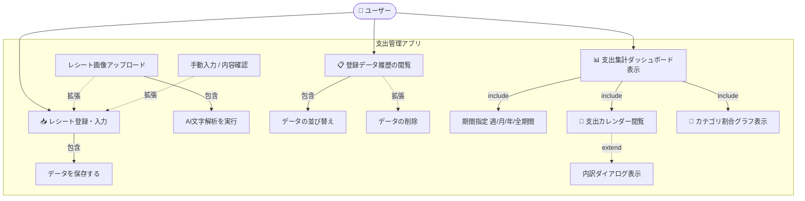
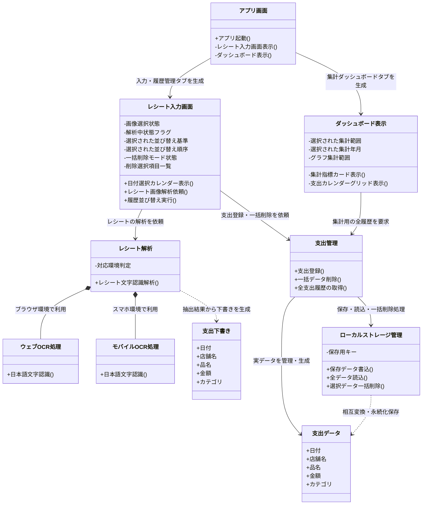
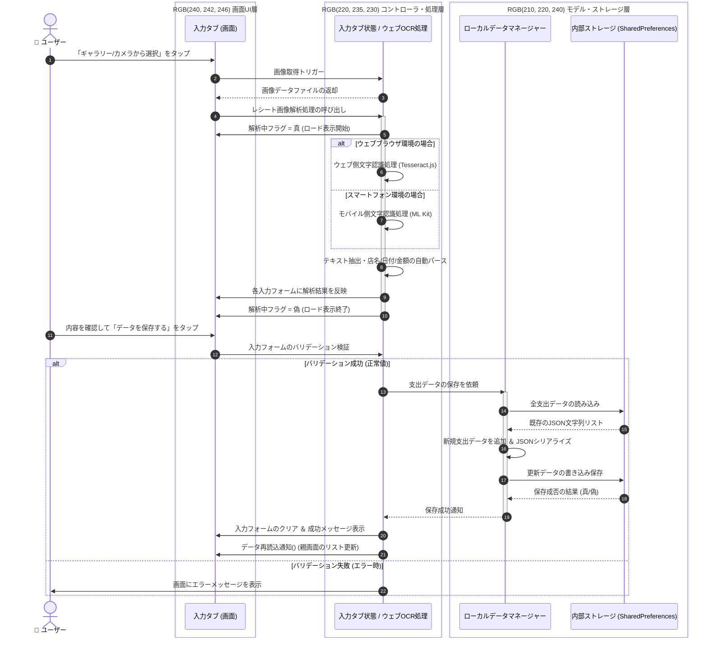
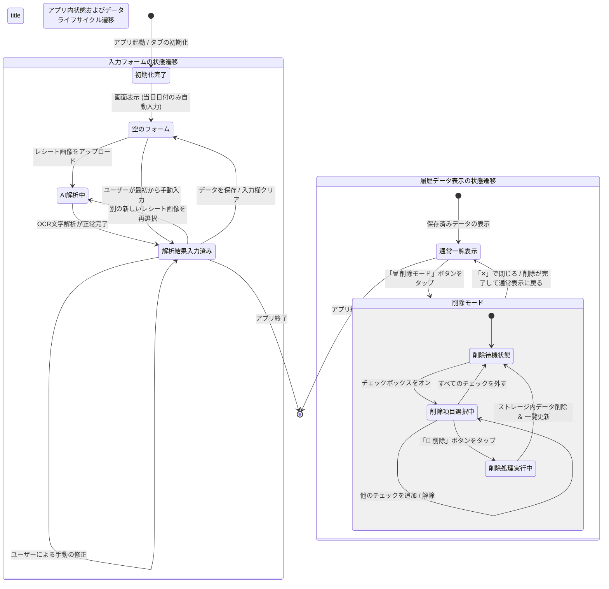

# レシートチェック＆支出管理アプリ

PBL（課題解決型学習）演習として開発した、レシート画像解析機能付きのクロスプラットフォーム（Web/モバイル対応）支出管理アプリケーションです。
手動での支出登録に加え、ブラウザ環境・モバイル環境それぞれにレシート解析補助機能を備え、最終的な支出データをローカルストレージ（SharedPreferences）で永続化・可視化します。

## 概要
本アプリは、「レシート入力の手間を減らす」ことと「正確なデータ管理」を両立する支出管理システムです。
OCRによる自動解析は100%の精度を目指すのではなく、**「AI/アルゴリズムが下書き（Draft）を作り、人間が確認・修正して確定（Confirm）する」**というアプローチ（Human-in-the-Loop）を採用し、ユーザーがストレスなく、かつ正確に家計簿をつけられる環境を提供します。

Flutterのワンコードにより、Webブラウザ環境（Tesseract.js連携）とスマートフォン環境（Google ML Kit連携）のマルチプラットフォームでシームレスに動作します。

---

## 機能要件
1. **支出の手動登録・編集確認機能**
   * 日付、店舗名、品名（複数行対応）、金額、カテゴリを管理・確認して登録できること。日付入力はカレンダーUI（showDatePicker）による選択を強制し、表記のブレを防止。
2. **Web/モバイル両対応のレシート画像解析補助機能（マルチエンジン対応）**
   * **Webブラウザ環境:** 外部JavaScriptライブラリ（Tesseract.js）を非同期インターオペラビリティ（dart:js）を介して呼び出し、日本語OCRを実行。自動ページセグメンテーションモードを最適化し、文字崩れを防止。
   * **モバイル環境:** Google ML Kit（TextRecognizer）を使用してオンデバイスで超高速・高精度な日本語文字認識を実行。
3. **データ検証（バリデーション）**
   * 必須項目の未入力や、金額への不適切な数値（マイナス値や非数値など）に対して、Flutter Formによるバリデーションを行い、適切なエラーメッセージを表示すること。
4. **SharedPreferencesによる高速なローカル永続化＆高度な履歴管理**
   * 確定した支出データをローカルの `SharedPreferences` にJSONエンコードして永続化・追記保存すること。
   * 履歴一覧では、**「新しい順」「金額順」「日付順」の双方向（昇順/降順）ソルト機能**、および**複数項目の一括選択・削除機能（削除モード）**を搭載。
5. **インタラクティブな集計・可視化ダッシュボード機能**
   * 期間フィルター（週単位・月単位・年単位・全期間）のラジオボタンとプルダウンを連動させ、選択期間の「累計総支出額」「選択期間の支出」「1日平均支出」を動的にリアルタイム計算。
   * **前期比（先週比/先月比/前年比）の差額と％（例: -3,500円 (-12.5%)）の算出。**
   * 動的な「支出カレンダー（カレンダーグリッド）」を独自実装。日付ごとのカテゴリ別支出金額をマッピングし、3種類以上のカテゴリ重複時は「内訳表示ダイアログ」をポップアップ。カレンダーのタップで週単位集計へ自動連動。
   * `fl_chart` パッケージを用いた視覚的でリッチな「カテゴリ割合円グラフ（Pizza Chart）」を動的表示。

---

## サブ機能一覧
* **UI（ユーザーインターフェース）部**
  * マテリアルデザイン（Tealカラーベース）を採用したメイン2タブ構成（📥レシート登録・入力 / 📊支出集計ダッシュボード）。
  * 共通画像プレビューコンポーネント（Web/モバイル共通の `Uint8List` メモリレンダリング）。
  * 双方向ソート付き履歴ビュー ＆ チェックボックス式一括削除モード。
  * 4メトリクス・ダッシュボード（累計、期間支出、日平均、前期比）。
  * マトリクス型・多機能支出カレンダー。
* **レシート解析・パース部**
  * テキストの平坦構造化処理（横一行ごとのlines配列抽出）。
  * 店名特定パースアルゴリズム（先頭n行の不要ノイズ・日付・電話番号等のキーワード除外、ブランチ店名結合、「ナインイレブン」ブレ補正等）。
  * 品名・日付・合計金額パースアルゴリズム（「計」「合」に反応する金額抽出、スマホ誤認識「預り/釣/務り」等の除外、数量・単価部分のRegExp前方一致カットトリミング）。
* **データ管理・ストレージ部**
  * `LocalDataManager` クラスによる抽象化。
  * JSONシリアライズ/デシリアライズ（`toMap` / `fromMap`）。
  * インデックス逆順ソートによる安全な複数レコード同時削除アルゴリズム。

---

## 作らないもの（スコープ外）
本プロジェクトの期間内では、以下の機能は実装対象外（スコープ外）とします。
* **ユーザー認証・アカウント管理機能**（ローカル環境での単一ユーザー利用を前提とするため、ログイン画面やマルチユーザー対応は行わない）
* **クラウドデータベース（RDB/NoSQL）の構築**（オフライン・クライアントサイド完結のため、外部サーバー連携は行わない）
* **高精度な汎用レシート解析**（あらゆるレシートへの対応は目指さず、特定のフォーマットや、一定の明瞭さを持つ画像にターゲットを限定する）
* **複数資産（口座・クレジットカード）の連携・管理**（現金や一括の支出管理のみに特化する）

---

## 設計図（Mermaid）

### ユースケース図

### クラス図

### シーケンス図

### 状態遷移図
