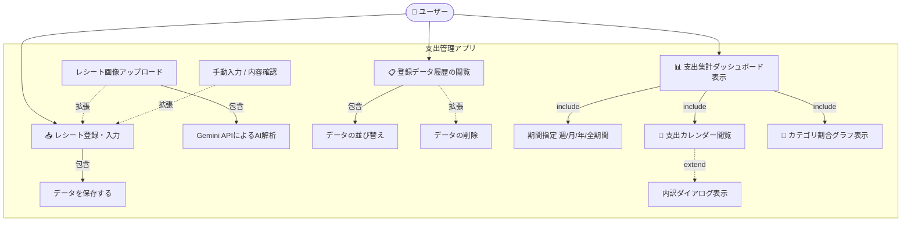
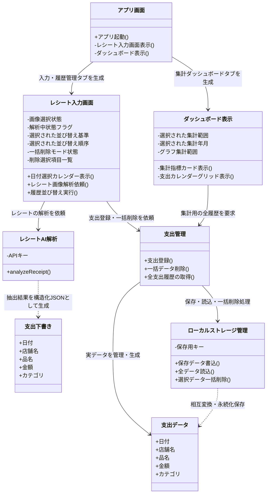
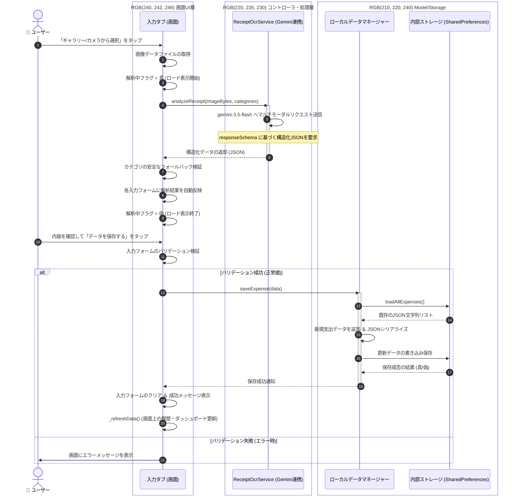
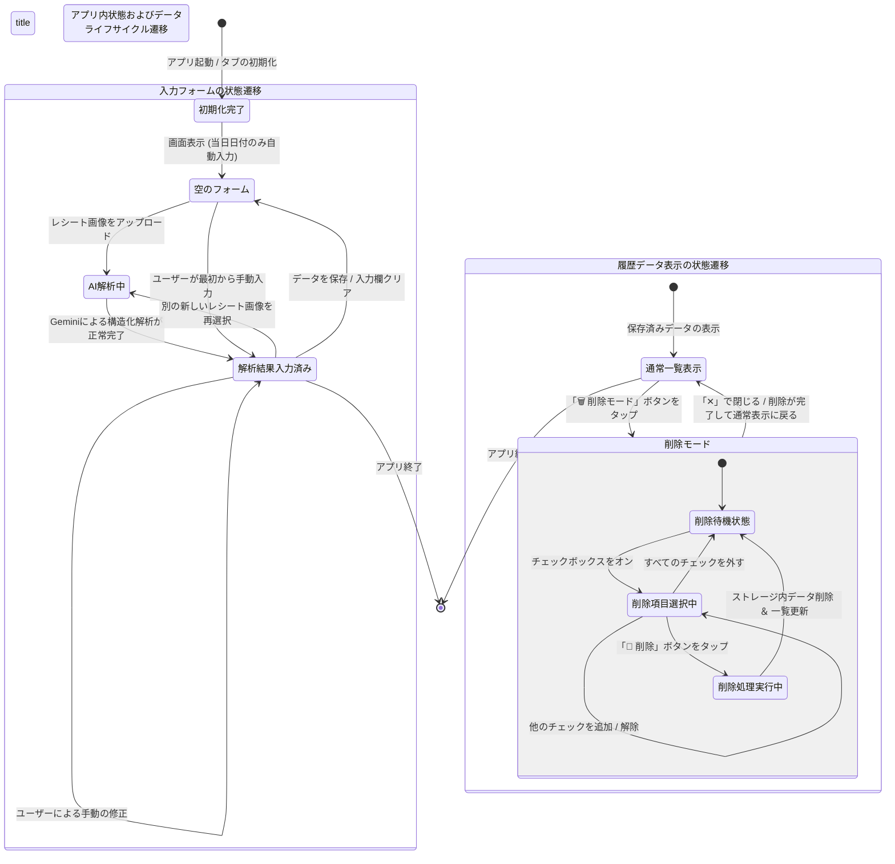

# レシートチェック＆支出管理アプリ

PBL（課題解決型学習）演習として開発した、レシート画像解析機能付きのクロスプラットフォーム（Web/モバイル対応）支出管理アプリケーションです。
手動での支出登録に加え、**Gemini APIを活用した高度なAIマルチモーダルレシート解析補助機能**を備え、最終的な支出データをローカルストレージ（SharedPreferences）で永続化・可視化します。

## 概要
本アプリは、「レシート入力の手間を減らす」ことと「正確なデータ管理」を両立する支出管理システムです。
OCRによる自動解析は100%の精度を目指すのではなく、**「AIが下書き（Draft）を作り、人間が確認・修正して確定（Confirm）する」**というアプローチ（Human-in-the-Loop）を採用し、ユーザーがストレスなく、かつ正確に家計簿をつけられる環境を提供します。

Flutterのワンコードにより、Webブラウザ環境およびスマートフォン環境のマルチプラットフォームでシームレスに動作します。

---

## 機能要件
1. **支出の手動登録・編集確認機能**
   * 日付、店舗名、品名（複数行対応）、金額、カテゴリを管理・確認して登録できること。日付入力はカレンダーUI（showDatePicker）による選択を強制し、表記のブレを防止。
2. **Gemini APIを駆使したAIレシート画像解析補助機能**
   * **マルチモーダル解析（`gemini-3.5-flash`）:** アップロードされたレシート画像から「取引日付」「店名」「購入した商品リスト」「合計金額（税込）」「適切な家計簿カテゴリ」をAIが統合的に判別。
   * **構造化データの自動生成（Structured Outputs）:** `responseSchema` を用いてGeminiから直接型安全なJSONを取得。アプリ側で定義された家計簿カテゴリ一覧との自動バリデーション（不一致時の安全なフォールバック）を実装。
   * スマホの標準カメラ起動時は、背面カメラ（`CameraDevice.rear`）を明示的に指定し動作の安定化。
3. **データ検証（バリデーション）**
   * 必須項目の未入力や、金額への不適切な数値（マイナス値や非数値など）に対して、Flutter Formによるバリデーションを行い、適切なエラーメッセージを表示すること。
4. **SharedPreferencesによる高速なローカル永続化＆高度な履歴管理**
   * 確定した支出データをローカルの `SharedPreferences` にJSONエンコードして永続化・追記保存すること。
   * 履歴一覧では、**「新しい順」「金額順」「日付順」の双方向（昇順/降順）ソート機能**、および**複数項目の一括選択・削除機能（削除モード）**を搭載。
5. **インタラクティブな集計・可視化ダッシュボード機能**
   * 期間フィルター（週単位・月単位・年単位・全期間）のラジオボタンとプルダウンを連動させ、選択期間の「累計総支出額」「選択期間の支出」「1日平均支出」を動的にリアルタイム計算。
   * **前期比（先週比/先月比/前年比）の差額と％（例: -3,500円 (-12.5%)）の算出。**
   * 動的な「支出カレンダー（カレンダーグリッド）」を独自実装。日付ごとのカテゴリ別支出金額をマッピングし、3種類以上のカテゴリ重複時は「内訳表示ダイアログ」をポップアップ。カレンダーのタップで週単位集計へ自動連動。
   * `fl_chart` パッケージを用いた視覚的でリッチな「カテゴリ割合円グラフ（Pizza Chart）」を動的表示。

---

## サブ機能一覧
* **UI（ユーザーインターフェース）部**
  * マテリアルデザイン（Tealカラーベース）を採用したメイン2タブ構成（📥レシート登録・入力 / 📊支出集計ダッシュボード）。
  * 共通画像プレビューコンポーネント（Web/モバイル共通の `Uint8List` メモリレンダリング）。
  * 双方向ソート付き履歴ビュー ＆ チェックボックス式一括削除モード。
  * 4メトリクス・ダッシュボード（累計、期間支出、日平均、前期比）。
  * マトリクス型・多機能支出カレンダー。
* **レシート解析・パース部**
  * `ReceiptOcrService` によるAI連携（API制限エラー `429/quota` 発生時のユーザーフレンドリーな通知処理）。
  * プロンプトエンジニアリングによる無駄なノイズ（住所、電話番号等）の自動除外と、税込最終支払金額の厳密な特定。
* **データ管理・ストレージ部**
  * `LocalDataManager` クラスによる抽象化。
  * JSONシリアライズ/デシリアライズ（`toMap` / `fromMap`）。
  * インデックス逆順ソートによる安全な複数レコード同時削除アルゴリズム。

---

## 環境構築・実行方法
## 📱 Webサイトでの利用・操作方法

デプロイ済みのWebサイトにアクセス後、以下の手順でレシート解析から支出登録までをスムーズに行うことができます。

### 1. レシート画像の読み込み
* **ファイルの選択**: 画面上部の「ギャラリーから選択」または「カメラで撮影」ボタンを押して、解析したいレシートの画像（JPEG/PNGなど）をアップロードします。
* **プレビュー確認**: アップロードが成功すると、画面中央にレシートの画像プレビューが表示されます。

### 2. AIによる自動解析の実行
* **自動スタート**: 画像が読み込まれると、バックグラウンドで自動的に **Gemini API（gemini-3.5-flash）** への解析リクエストが走ります。
* **ロード画面**: 解析中はローディングインジケータ（ぐるぐる）が表示されます。
  > 💡 *万が一、サーバー混雑により「503 UNAVAILABLE」のエラーが出た場合は、少し時間を置いてもう一度画像をアップロードし直してください。*

### 3. 解析結果の確認と手動修正（Human-in-the-Loop）
* **フォームへの自動入力**: 解析が完了すると、「日付」「店舗名」「金額」「カテゴリ」「品名（複数行）」の各入力欄にAIの予測結果が自動でセットされます。
* **人間の手による修正**: AIの判定が間違っている部分や、細かく修正したい箇所（品名の調整やカテゴリの変更など）があれば、各フォームをタップして自由に手動修正してください。

### 4. データの保存とダッシュボードへの反映
* **保存**: 内容に問題がなければ「データを保存する」ボタンをタップします。フォームのバリデーション（必須入力チェックなど）が通り、保存完了メッセージが出れば完了です。
* **確認**: 保存されたデータは、即座に画面下部の「履歴一覧」に追記されるほか、もう一つのタブである「📊支出集計ダッシュボード」のグラフや支出カレンダー、各種メトリクス（前期比など）へリアルタイムに自動反映されます。
---
### ⚠️ 利用上の注意事項（エラーハンドリングについて）

Gemini APIの利用状況やサーバー負荷により、レシート解析時に以下の赤色のエラーメッセージが表示される場合があります。

> **`解析エラー: GenerativeAIException: Server Error [503]: ... "status": "UNAVAILABLE"`**

* **原因:** 主としてGoogle側の無料枠（Free Tier）でのリクエスト集中や、サーバーへの一時的な高負荷（High demand）が原因で発生します。APIキーの認証エラーやアプリの実装ミスではありません。
* **対策:** このエラーは一時的なものであるため、**少し時間を置いてから再度レシート画像をアップロード・解析し直す**ことで正常に処理されます。また、解析が利用できない場合でも手動での支出入力・保存機能は通常通り動作します。

---

## 作らないもの（スコープ外）
本プロジェクトの期間内では、以下の機能は実装対象外（スコープ外）とします。
* **ユーザー認証・アカウント管理機能**（ローカル環境での単一ユーザー利用を前提とするため、ログイン画面やマルチユーザー対応は行わない）
* **クラウドデータベース（RDB/NoSQL）の構築**（オフライン・クライアントサイド完結のため、外部サーバー連携は行わない）
* **高精度な汎用レシート解析**（あらゆるレシートへの対応は目指さず、特定のフォーマットや、一定の明瞭さを持つ画像にターゲットを限定する）
* **複数資産（口座・クレジットカード）の連携・管理**（現金や一括の支出管理のみに特化する）

---

## 技術考察：GitHub SecretsによるCI/CD堅牢化とクライアントサイドにおけるAPIキー露出のトレードオフ

### 1. GitHub Secrets導入による成果とセキュリティ的意義
本プロジェクトでは、Gemini APIキーなどの機密情報をソースコード内にハードコーディングすることを防ぐため、GitHub Secretsを利用した環境変数の注入（`--dart-define`）およびGitHub Actionsによる自動ビルド・デプロイ環境を構築しました。
これにより、Gitリポジトリのソースコード履歴（コミットログ）やパブリックなリポジトリ上にAPIキーが生データとして残るリスクを完全に排除しており、静的なソースコード管理におけるセキュリティのベストプラクティスを達成しています。

### 2. フロントエンド完結型アーキテクチャにおける技術的限界と露出リスク
一方で、本アプリケーションはバックエンドサーバーを介さず、Webブラウザ（フロントエンド）から直接Googleの各種APIエンドポイントへ通信を行う「フロントエンド完結型（クライアントサイド）アーキテクチャ」を採用しています。
Flutter Webの仕様上、ビルド時に埋め込まれたAPIキーは難読化されるものの、最終的にはブラウザ上で実行可能なJavaScriptバイナリに含まれます。また、Gemini APIへのリクエストを送信する際には、認証のためにHTTPヘッダーまたはクエリパラメータに生のAPIキーを載せて通信する必要があります。

このため、以下の経路からAPIキーが第三者に抽出されるリスクが構造的に残されています。
* **通信の傍受（リバースプロキシ・デベロッパーツール）**: ユーザーがブラウザのデベロッパーツール（F12）の「ネットワーク（Network）」タブを確認することで、送信されるAPIキーの文字列を容易に取得できてしまいます。
* **ソースコードの静的解析**: 生成されたJavaScriptファイルを解析・走査することで、難読化された文字列の中からキーが特定される可能性があります。

### 3. 結論と今後の改善展望（To-Be）
本演習（PBL）の要件においては、開発効率とプロトタイプ運用の迅速性を最優先し、アクセス集中のリスクが低い限定的な環境での運用を前提としたため、現状のアーキテクチャを採用しました。しかし、本番環境へのスケールアップや不特定多数への一般公開を想定する場合、セキュリティ面での根本的な解決策として以下のいずれかの設計変更が必要であると考察します。

1. **APIプロキシサーバー（BFF: Backend For Frontend）の導入**
   フロントエンドからは自前のサーバー（Firebase FunctionsやAWS Lambdaなど）を経由して通信させ、APIキーはサーバーサイドの環境変数でのみ管理する設計。これによりブラウザ側へのキーの露出を100%防ぐことができます。
2. **BYOK（Bring Your Own Key）モデルの採用**
   アプリ起動時にユーザー自身が取得したGemini APIキーを入力させるUIを実装し、キーの管理責任を各クライアントに委ねる設計。

本プロジェクトを通じて、開発パイプライン（GitHub）の堅牢化と、実行環境（Webブラウザ）のセキュリティ特性は切り離して設計する必要があるという、モダンなWebアプリケーション開発における重要な知見を得ることができました。

---

## 設計図（Mermaid）

### ユースケース図

### クラス図

### シーケンス図

### 状態遷移図
